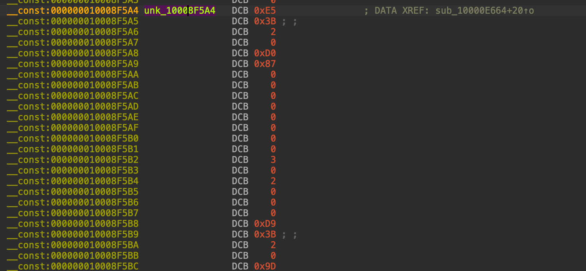
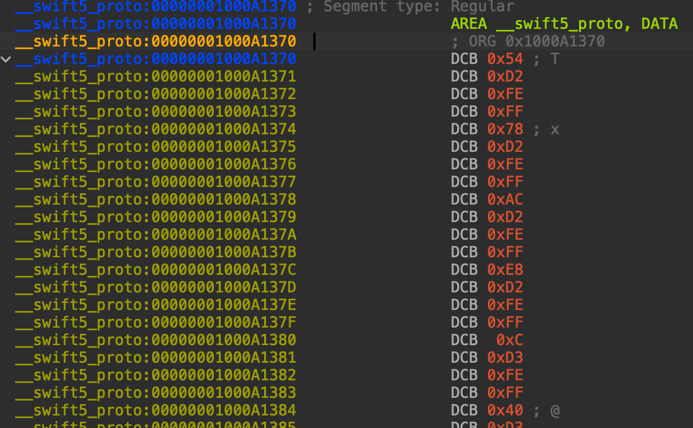
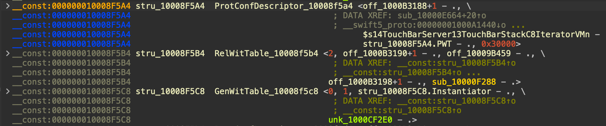

# Overview

IDA scripts to help you:

- [`objc_stubs.py`](objc_stubs.py)
    - Fix all `objc_*` symbol types
- [`objc_hotkeys.py`](objc_hotkeys.py)
  - Add `Ctrl+4` HotKey to quickly navigate to selector's Xrefs.
- [`fix_proto_conf_desc`](fix_proto_conf_desc.py)
  - Parse __swift5_proto segment and parse the ProtocolConformanceDescriptors they point to.

# (objc_stubs.py) Before and After

Before running [`objc_stubs.py`](objc_stubs.py):

After running [`objc_stubs.py`](objc_stubs.py):

As you can see:

- The scripts fixed all selectors signatures:
  - For example: `int __cdecl __spoils<X0,X1,X2,X3,X4,X5,X6,X7> objc_msgSend_initWithCapacity_(id object, __unused SEL selector, id initWithCapacity)`
- In addition to fixing the `objc_retain/release` which now access high registers.
  - For example: `id __usercall __spoils<> objc_retain_x20_45@<X0>(id x20@<X20>)`

This makes it much easier to navigate through the code flow.

# (fix_proto_conf_desc) Before and After

Before running [`fix_proto_conf_desc.py`](fix_proto_conf_desc.py):

In a random PCD definition:

The __swift5_proto segment definition:

After running [`fix_proto_conf_desc.py`](fix_proto_conf_desc.py):

The __swift5_proto segment definition:

As you can see:
  - Relative offsets are created in __swift5_proto segment to point to the ProtocolConformanceDescriptor
  - Parse the ProtocolDescriptorConformance (together with  RelativeWitnessTable and GenericWitnessTable). They will be created as structs so you can use the UI to explore them by expanding the struct.

Have fun!
